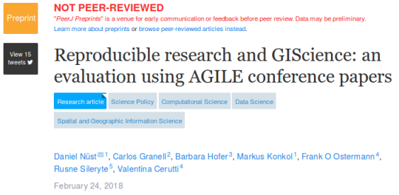

# Reproducible Research Publications @ AGILE 2018

Workshop at the [21st AGILE International Conference on Geographic Information Science](http://agile-online.org/index.php/conference/conference-2018), Lund, Sweden

Reproducibility and replicability of research gains more attention each year across many domains, some of which even struggle with a "reproducibility crisis".
However, at AGILE conferences, the topic is underrepresented.
Recent research (submitted to AGILE 2017) found that none of the last years nominees for best papers (both short & full papers) provided sufficient information (i.e. instructions, data, and code) to be reproduced independently by a third party.

This workshop introduces interested scientists and developers to reproducible research and gives hands-on guidance on how to increase the degree of reproducibility for their own work.
Participants explore the practical principles of reproducible papers by reproducing a provided real-world publication.
Together with the instructors they create a reproducible document from text, code, and data of a scholarly publication and publish it in a data repository.

## Agenda

The workshop takes place in room **Flygeln (Öresund)**, a seminar room on the 1st floor of [Geocentrum 1](https://agile-online.org/practical-and-local-information-2018/venues-and-social-events-2018), on Tuesday June 12 at **14:30** CEST.

The planned agenda for the half-day workshop (4 hours in total) is as follows:

1. Introduction to reproducible research: relevant literature, challenges, and solutions (lecture) [15 min.]
2. Reproducibility at AGILE today (presentation) [15 min.] 
Take a look at this [recent pre-print](https://doi.org/10.7287/peerj.preprints.26561v1) if you want to learn more:

3. Hands-on reproducible research [180 mins. including breaks, two break-out sessions]
    - **Goal:** Reproducing a paper with either _R_ or _Python_ code
        - Participants make first-hand experiences in trying to reproduce a prepared computational analysis from a real paper
        - Transform a "typical" publication into a reproducible document
        - Publish the analysis in a research data repository
    - **Skills:** Tools for creating reproducible documents (literate programming wit R Markdown or Jupyter Notebook), scripted geospatial workflows for GIS
4. Reproducibility at AGILE tomorrow (discussion, presentation) & Feedback [30 min.]

## Registration

Participants are required to on the AGILE conference website.

In addition participants must submit some information to the [workshop repository on GitHub](https://github.com/o2r-project/reproducible-agile) by [creating a new issue](https://github.com/o2r-project/reproducible-agile/issues/new) **until May 27 2018**.

The issue must include

1. preferred hands-on session (_R_ or _Python_),
1. a short description of experience in R and/or Python
1. a summary of computational work, if available with references to published papers, data or code, and
1. plans for future computer-based research.

Basic skills in the selected programming language are required to participate in the workshop (e.g. practical experiences as part of a research project) - please get in touch if you are unsure!

In case of a high number of publications, participants may be selected based on the submitted material.
Participants must bring their own computers and be prepared to install software _before and at_ the workshop.

The number and topics of hands-on sessions depend on room availability and participants' interests.
They will be announced on _May 15 2018_.

## Organizing Committee

- [Daniel Nüst](https://orcid.org/0000-0002-0024-5046) (ifgi), daniel.nuest@uni-muenster.de (main contact), [@nuest](https://github.com/nuest)
- [Frank Ostermann](https://orcid.org/0000-0002-9317-8291) (ITC), f.o.ostermann@utwente.nl, [@foost](https://github.com/foost)
- [Markus Konkol](https://orcid.org/0000-0001-6651-0976) (ifgi), m.konkol@uni-muenster.de, [@MarkusKonk](https://github.com/MarkusKonk)
- [Barbara Hofer](https://orcid.org/0000-0001-7078-3766) (Z_GIS)
- [Carlos Granell](https://orcid.org/0000-0003-1004-9695) (Jaume I)
- [Valentina Cerutti](https://orcid.org/0000-0002-9612-1581) (ITC)
- [Rusne Sileryte](https://orcid.org/0000-0002-8245-3016) (TU Delft)
